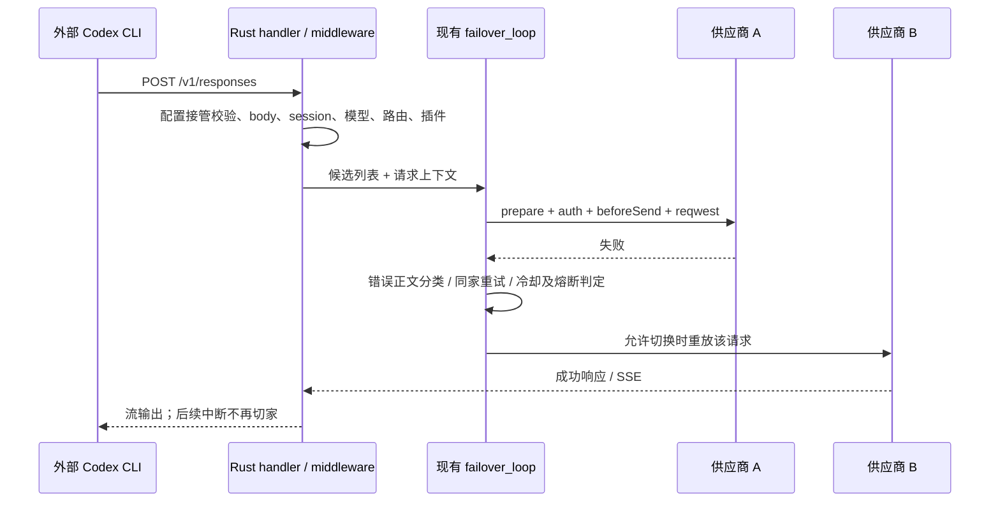
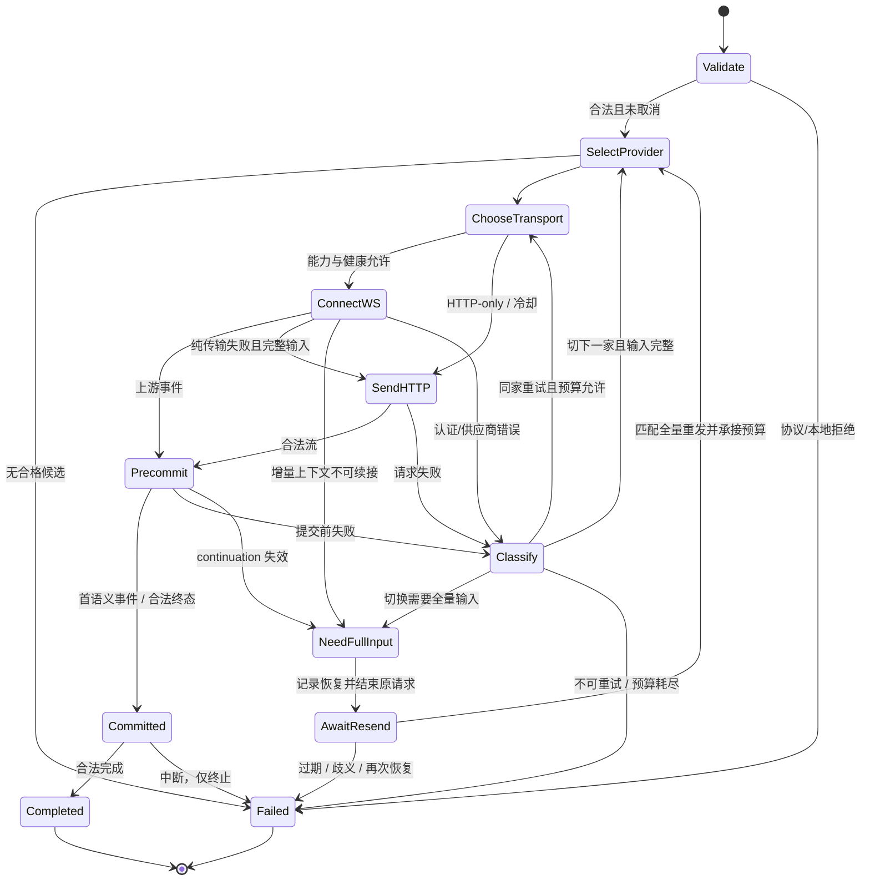
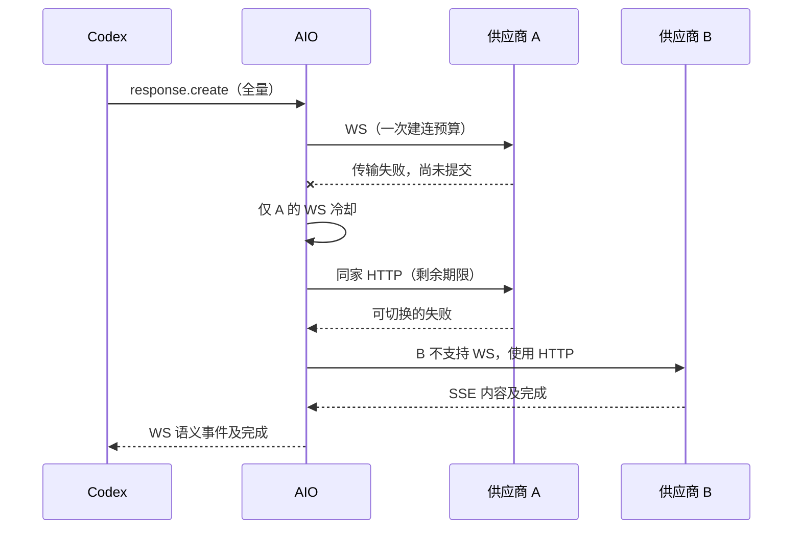

# Codex Responses WebSocket 开发规范

> 状态：M0 协议前提已验证，配置、WS 主链路和受控恢复已实现并进入最终回归；默认关闭。真实 CLI 经 AIO 的工具恢复与换家已通过，跨平台实机网络验收仍待执行。
>
> 日期：2026-09-27。代码基线：AIO `420e9958`。
>
> 范围：Codex CLI 经 AIO 本地网关访问模型供应商时的 Responses WebSocket。
>
> 已确认：采用本文默认策略；2026-09-27 已获实现授权。开发不提交、不推送；阶段证据见 [M0 验证记录](./codex-responses-websocket-m0-report.md)。
>
> 复审记录：[开发 spec 二次复审](./codex-responses-websocket-spec-review.md)。

## 1. 目标、术语与验收底线

### 1.1 产品目标

在保留现有供应商排序、会话偏好、鉴权重写、协议适配、失败切换和请求日志的基础上，让 Codex CLI 可以使用 Responses API WebSocket。某家不支持 WS 时继续使用它的 HTTP/SSE；某家真正不可用时，继续尝试符合现有路由规则的下一家。

首版成功不以“握手返回 101”衡量，必须同时证明：连续请求、工具调用、同家降级、跨家切换、取消、日志和非 WS 回归均符合本文契约。

### 1.2 术语

| 名称              | 本文定义                                                                                            |
| ----------------- | --------------------------------------------------------------------------------------------------- |
| 下游              | Codex CLI → AIO；传输可以是 HTTP/SSE 或 Responses WS                                                |
| 上游              | AIO → 当前实际供应商；独立选择 HTTP/SSE 或 Responses WS                                             |
| 供应商            | AIO `ProviderForGateway` 对应的端点、认证和路由配置；与 Codex 看到的 `model_providers.aio` 分属两层 |
| 逻辑生成          | 一次模型生成意图；可能经历多个上游 attempt，或一次受控的客户端完整请求重发                          |
| 请求              | 一个 HTTP 请求或一条有效 `response.create`；拥有独立 `trace_id`、日志和终态                         |
| 业务尝试          | 现有 `retry_index` 对应的同家重试机会；一次业务尝试可包含 WS 及同家 HTTP 降级                       |
| attempt           | 一次具体上游发送；使用独立 `attempt_index`，同家换传输也必须可单独观察                              |
| 提交（committed） | 首个客户端可见的语义事件被交给下游发送；随后禁止透明重放                                            |
| 上下文失效        | 当前增量输入引用的响应状态无法在选定账号、连接或传输上继续使用                                      |
| 全量重发          | Codex 按自己的当前上下文生成完整 `input`，不是承诺展开压缩前的全部历史                              |
| 能力声明          | 用户声明供应商支持 WS；不等于运行时健康，不为此新建预设系统                                         |
| WS 冷却           | 只暂停相应上游 WS 尝试，不影响同供应商 HTTP 可用性                                                  |

本功能不包含 Codex app-server / `--remote` / JSON-RPC over WebSocket 控制面。现有 app-server 模型目录查询维持原职责。[E02]

### 1.3 不可退让的验收底线

- **R01**：全局关闭时，现有 HTTP/SSE、非 Codex CLI、供应商切换和配置恢复行为通过回归。
- **R02**：先选供应商，再选传输；不能把“只支持 HTTP”当成不合格供应商。
- **R03**：WS 传输失败与供应商失败分别归因；同家安全降级优先于因传输问题换家。
- **R04**：透明重试同时要求“尚未提交”和“输入完整或上游上下文确实可用”；缺一不可。
- **R05**：提交后失败仅终止当前生成，禁止把下一家完整响应拼到旧流后面。
- **R06**：优先验证 Codex 原生全量重发；首版不建设完整历史缓存或响应 Replay。
- **R07**：上下文恢复不能重置候选遍历、失败预算或强制供应商约束。
- **R08**：认证、插件、用量、日志和终态仍由现有对应模块统一负责，不因转码执行两遍。
- **R09**：不同连接不能抢占同一条正在生成的上游 WS；取消和退出不遗留任务。
- **R10**：用户能区分当前供应商、两跳传输、降级、切家与上下文恢复。
- **R11**：Windows、macOS、Linux、Windows + WSL 的配置和网络路径均有验收记录。
- **R12**：没有完成真实 CLI 故障注入测试，不得宣称“增量请求可自动跨供应商恢复”。

## 2. 现有架构与证据索引

下面是设计时源码基线的事实；后文标为“新增”的字段、状态和行为是本次实现合同，实际进度及实验边界见 [验证记录](./codex-responses-websocket-m0-report.md)。

| 编号 | 当前事实与关键符号                                                                                                                                                                             | 代码入口                                                                                                                                                                                                                                                                                                  |
| ---- | ---------------------------------------------------------------------------------------------------------------------------------------------------------------------------------------------- | --------------------------------------------------------------------------------------------------------------------------------------------------------------------------------------------------------------------------------------------------------------------------------------------------------- |
| E01  | `cli_proxy_set_enabled_impl` 确保网关启动，再调用 CLI 代理配置接管；`apply_proxy_config` 写入 `model_providers.aio`、`base_url=<origin>/v1`、`wire_api=responses`。用户的外部 Codex 进程发请求 | [服务](../src-tauri/src/app/cli_proxy_service.rs)、[Codex 配置](../src-tauri/src/infra/cli_proxy/codex.rs)、[前端 service](../src/services/cli/cliProxy.ts)                                                                                                                                               |
| E02  | `fetch_model_catalog` 启动 `codex app-server --stdio`，通过 initialize / model/list 读取模型；不是本项目的模型生成通道                                                                         | [模型目录协议](../src-tauri/src/infra/codex_model_catalog/protocol.rs)                                                                                                                                                                                                                                    |
| E03  | `build_router` 提供 `/v1/*path`、`/:cli_key/*path`、强制供应商路径；当前没有 Responses WS Upgrade 接管                                                                                         | [路由](../src-tauri/src/gateway/routes.rs)                                                                                                                                                                                                                                                                |
| E04  | `proxy_impl` 运行中间件、注册 active request / 日志占位，再进入 `forwarder::forward` → `failover_loop::run`                                                                                    | [handler](../src-tauri/src/gateway/proxy/handler/mod.rs)、[forwarder](../src-tauri/src/gateway/proxy/forwarder/mod.rs)、[外层循环](../src-tauri/src/gateway/proxy/handler/failover_loop/mod.rs)                                                                                                           |
| E05  | `ProviderSummary` / `ProviderForGateway` 有端点、认证、模型策略、桥接关系和流静默超时，没有本功能的 WS 能力字段                                                                                | [供应商类型](../src-tauri/src/domain/providers/types.rs)                                                                                                                                                                                                                                                  |
| E06  | 默认路由 `default_route_providers.sort_order`、模板 `sort_mode_providers.sort_order` 决定顺序；模型策略、强制选择、会话偏好进一步约束候选                                                      | [查询](../src-tauri/src/domain/providers/queries.rs)、[provider resolution](../src-tauri/src/gateway/proxy/handler/middleware/provider_resolution.rs)                                                                                                                                                     |
| E07  | `run_retry_loop` 根据 `ContinueRetry` 同家重试、`BreakRetry` 转下一家、`Return` 结束；每家从请求内容准备认证、模型和协议适配                                                                   | [retry engine](../src-tauri/src/gateway/proxy/handler/failover_loop/attempt/retry_engine.rs)、[provider preparation](../src-tauri/src/gateway/proxy/handler/failover_loop/prepare/provider_iterator.rs)                                                                                                   |
| E08  | `execute_attempt` → `inject_auth` → sanitizer → beforeSend hook → 最终请求准备 → `send_upstream`；当前上游是 reqwest                                                                           | [attempt](../src-tauri/src/gateway/proxy/handler/failover_loop/attempt/attempt_executor.rs)、[认证](../src-tauri/src/gateway/proxy/handler/failover_loop/attempt/attempt_auth.rs)、[发送](../src-tauri/src/gateway/proxy/handler/failover_loop/attempt/send.rs)                                           |
| E09  | HTTP 状态初分类后还会进行错误正文匹配、OAuth 刷新、额度和并发限制识别；不能只复制状态码 switch                                                                                                 | [分类](../src-tauri/src/gateway/proxy/errors.rs)、[完整错误处理](../src-tauri/src/gateway/proxy/handler/failover_loop/response/upstream_error.rs)                                                                                                                                                         |
| E10  | `handle_success_event_stream` 预读首个网络块；返回流后，后续中断不会重新进入供应商循环；当前没有统一语义提交门控                                                                               | [流式成功处理](../src-tauri/src/gateway/proxy/handler/failover_loop/response/success_event_stream.rs)、[usage tee](../src-tauri/src/gateway/streams/usage_tee.rs)                                                                                                                                         |
| E11  | `finalize_circuit_and_session` / `emit_request_event_and_spawn_request_log` 负责健康、成功绑定、active request 结束、事件和日志；`RequestAbortGuard` 负责流所有权移交前的取消兜底              | [finalize](../src-tauri/src/gateway/streams/finalize.rs)、[request end](../src-tauri/src/gateway/streams/request_end.rs)、[abort guard](../src-tauri/src/gateway/proxy/abort_guard.rs)                                                                                                                    |
| E12  | `SessionManager` 保存供应商绑定和路由偏好；`CodexSessionIdCache` 保存指纹与会话 ID 映射，不保存完整历史                                                                                        | [session manager](../src-tauri/src/gateway/session_manager.rs)、[会话标识补齐](../src-tauri/src/gateway/codex_session_id.rs)                                                                                                                                                                              |
| E13  | `remove_codex_previous_response_id` 在命中特定错误时删除引用并重试，不补历史                                                                                                                   | [现有 rectifier](../src-tauri/src/gateway/proxy/handler/failover_loop/response/upstream_error.rs)                                                                                                                                                                                                         |
| E14  | 当前默认每家尝试 5 次、最多 5 家、首字节 30 秒、流静默 300 秒、供应商冷却 30 秒；准备/修复逻辑可能扩展尝试数                                                                                   | [默认值](../src-tauri/src/infra/settings/defaults.rs)、[尝试上限](../src-tauri/src/gateway/proxy/handler/failover_loop/prepare/provider_iterator.rs)                                                                                                                                                      |
| E15  | `FailoverAttempt` / `GatewayAttemptEvent`、`gateway:attempt`、traceStore、ProviderChainView 提供现有切换观测；没有完整的两跳传输字段                                                           | [事件](../src-tauri/src/gateway/events.rs)、[前端接收](../src/services/gateway/gatewayEvents.ts)、[trace store](../src/services/gateway/traceStore.ts)、[供应商链](../src/components/ProviderChainView.tsx)                                                                                               |
| E16  | `build_client_with_redirect` 负责现有 HTTP 代理/TLS等配置；`GatewayRuntime` 和 cleanup 负责网关任务关闭                                                                                        | [HTTP client](../src-tauri/src/gateway/http_client.rs)、[runtime](../src-tauri/src/gateway/runtime.rs)、[cleanup](../src-tauri/src/app/cleanup.rs)                                                                                                                                                        |
| E17  | native Codex 路径经 `codex_paths` 解析；WSL 有独立生成与备份/恢复路径，不能只改 native                                                                                                         | [路径](../src-tauri/src/infra/codex_paths.rs)、[WSL Codex](../src-tauri/src/infra/wsl/config_codex.rs)、[native 接管](../src-tauri/src/infra/cli_proxy/codex.rs)                                                                                                                                          |
| E18  | `apply_recent_error_cache_gate` 可短路不可用请求；它与客户端上下文恢复不是同一种缓存                                                                                                           | [recent error gate](../src-tauri/src/gateway/proxy/handler/request_fingerprint.rs)、[不可用终态](../src-tauri/src/gateway/proxy/handler/failover_loop/response/finalize.rs)                                                                                                                               |
| E19  | 生产请求接入 afterBodyRead、beforeSend、response.chunk / response.after、gateway.error、log.beforePersist；部分 hook 仅声明未调用                                                              | [body reader](../src-tauri/src/gateway/proxy/handler/middleware/body_reader.rs)、[chunk hook](../src-tauri/src/gateway/streams/plugin_chunk.rs)、[日志](../src-tauri/src/gateway/proxy/logging.rs)、[声明](../src-tauri/src/gateway/plugins/context.rs)                                                   |
| E20  | 内置 CX2CC 是 Claude Messages → Codex Responses 桥，实际凭据来自 source provider；其下游协议和归属不同                                                                                         | [桥注册](../src-tauri/src/gateway/proxy/protocol_bridge/registry.rs)、[桥准备](../src-tauri/src/gateway/proxy/handler/failover_loop/prepare/cx2cc_preparation.rs)、[桥流](../src-tauri/src/gateway/proxy/protocol_bridge/stream.rs)                                                                       |
| E21  | `max_request_body_bytes` 默认 128 MiB，可由现有环境变量调整；chunk channel 的数量上限不等于内存字节上限                                                                                        | [限制](../src-tauri/src/gateway/util.rs)、[usage relay](../src-tauri/src/gateway/streams/usage_tee.rs)                                                                                                                                                                                                    |
| E22  | CodexTab 存在旧 `responses_websockets_v2` 配置项；不能以它作为本功能有效开启的判断依据                                                                                                         | [Codex 设置页](../src/components/cli-manager/tabs/CodexTab.tsx)                                                                                                                                                                                                                                           |
| E23  | `SettingsUpdate` 输入为 camelCase；`SettingsView` 输出为 snake_case；`SettingsRuntimePlan::from_settings` 决定 native/WSL 同步，`SettingsMutationRuntime` 分别返回同步/触发状态                | [settings app service](../src-tauri/src/app/settings_service.rs)、[settings command](../src-tauri/src/commands/settings.rs)、[前端字段映射](../src/services/settings/settings.ts)、[query](../src/query/settings.ts)                                                                                      |
| E24  | `ProviderUpsertInput` → `ProviderUpsertParams` → SQL；`ProviderExport` 与导入/导出是手工字段映射，不会自动覆盖新增字段                                                                         | [provider app service](../src-tauri/src/app/provider_service.rs)、[CRUD command](../src-tauri/src/commands/providers/crud.rs)、[导出契约](../src-tauri/src/infra/config_migrate/mod.rs)、[导出](../src-tauri/src/infra/config_migrate/export.rs)、[导入](../src-tauri/src/infra/config_migrate/import.rs) |
| E25  | WSL `read_wsl_current_values` 未记录 aio 表内原值，`restore_codex_config_toml` 会移除 aio 表；与 native 按表合并的恢复行为不同                                                                 | [WSL manifest](../src-tauri/src/infra/wsl/manifest.rs)、[WSL status dispatch](../src-tauri/src/infra/wsl/status.rs)                                                                                                                                                                                       |

### 2.1 当前请求时序



### 2.2 当前实现不具备的保证

`upstream_sent` 是观测信息，不提供跨供应商幂等。现有 session 偏好不提供跨账号 prompt cache 或响应状态迁移。现有删除 `previous_response_id` 的修复也不能证明增量历史完整。以上能力不得在开发说明或 UI 中标为已有。[E07–E13]

## 3. 已确认方案与功能边界

### 3.1 主方案

Rust 负责终止下游 Responses WS，将每条 `response.create` 接入现有请求处理与供应商选择链，再依据实际供应商能力选择上游传输。WS/SSE 适配必须服务于复用现有处理链，不新增第二套供应商调度器。

默认策略：

1. 全局开关默认关闭；供应商 WS 声明默认 `false`。
2. 保留 HTTP-only 供应商；不得按 WS 能力过滤、重排候选池。
3. HTTP 入站保持 HTTP 上游；本次不新增通用 HTTP → WS 加速模式。
4. WS 入站允许 WS 或 HTTP/SSE 上游；降级时下游仍可保持 WS。
5. 完整输入上的纯 WS 传输失败，先同供应商 HTTP；HTTP 再失败才交回现有失败策略。
6. 增量输入不能无条件降级/换家。必要时先请求 Codex 全量重发，参见第 7 节。
7. 原生 Responses provider 才可启用上游 WS；桥接流量保留原 HTTP/SSE 路径。
8. 首版不提供 WS-only，不建共享连接池，不增加抢占、负载竞速或新的 sticky 算法。
9. 首版不引入 Redis、响应 Replay、完整会话历史持久化或订阅账号池。
10. 产品只承诺 AIO 自己的尝试与输出边界；不能承诺外部 Codex 永不自行重试。

### 3.2 支持矩阵

| 场景                                                 | 首版要求                                                                                     |
| ---------------------------------------------------- | -------------------------------------------------------------------------------------------- |
| Codex HTTP → 原生 provider HTTP/SSE                  | 保持现有行为                                                                                 |
| Codex WS → 声明支持且健康的原生 provider WS          | 新增，需完整验收                                                                             |
| Codex WS → HTTP-only provider                        | 新增 SSE → WS；不能跳过该供应商                                                              |
| Codex WS → API key provider                          | 核心验收场景                                                                                 |
| Codex WS → OAuth 原生 Responses provider             | 沿用实际 adapter 的 endpoint、刷新和账号头；只有通过相应验证的路径启用 WS，其他路径仍用 HTTP |
| Claude / Gemini / Grok 等现有 HTTP 请求              | 不受全局 Codex WS 开关影响                                                                   |
| Claude CX2CC → source Codex provider                 | 仍走现有 HTTP/SSE，即使 source 声明支持 WS                                                   |
| app-server stdio 模型目录查询                        | 保持现状，不改成控制面 WS                                                                    |
| Responses compact、模型发现、count_tokens 等辅助请求 | 原路径和统计分类保持；不自动当成普通 WS 生成                                                 |
| `generate=false` WS 预热                             | M0 必测；不得错误触发真实生成、健康成功绑定或普通生成统计，见第 6 节                         |
| 非标准 WS 协议、音视频 Realtime API、任意二进制帧    | 不支持，明确错误                                                                             |

### 3.3 对参考项目的采用与放弃

- sub2api：采用账号/供应商级能力、传输与账号失败分离、提交前切换、连接独占的原则；不引入账号池、计费分发和抢占式连接池。研究快照中的 WS 冷却 helper 存在，不代表它已被生产路径调用。
- claude-code-hub：采用“WS 接入复用原业务链”“首内容前门控”“上游连接归属下游会话”“有界缓冲”思想；不照搬 Node 内部 HTTP 回环、Redis/PG Replay 与多实例所有权系统。
- Replay 重建的是已有响应块；它不补齐新请求缺少的历史。上游连接复用也不保证连接丢失后的状态迁移。
- 本仓库已有应用级代理。架构冲突在于把 WS 当透明 socket 隧道会绕过鉴权重写、插件和失败切换；完整复制参考网关又会重复本仓库已有业务层。

固定版本参考位于第 16 节；引用是设计证据，不是直接复制实现的授权或开发步骤。

## 4. 开发规范与变更落点

### 4.1 分层责任

| 层                | 必须负责                                            | 不应承担                               |
| ----------------- | --------------------------------------------------- | -------------------------------------- |
| React 页面 / 组件 | 开关、能力声明、状态解释、错误提示、供应商链展示    | WS 建连、凭据处理、重试状态机          |
| services / query  | IPC 调用、结果校验、缓存失效、订阅生命周期          | 重复定义生成 DTO，推测后台连接状态     |
| Tauri command     | 接收 DTO，转交 app/domain，返回结构化结果           | 直接拼 WS 协议或持有连接               |
| app / infra       | 设置生效、CLI 配置接管/恢复、代理与应用生命周期     | 新增独立供应商排序规则                 |
| gateway           | 路由、WS 生命周期、传输选择、恢复、错误分类、流边界 | 账号池、跨用户内容缓存、CLI 控制面     |
| domain / DB       | 供应商持久化能力及配置一致性                        | 持久化 socket、健康计时器或完整 prompt |

### 4.2 工程规则

- 先查现有实现和调用者，再修改最小公共路径；通过 CodeGraph 找入口，再用源码核对，图里的同名符号不能代替源码证据。
- `src-tauri/src/lib.rs` 保持组合层；command 保持薄层；Rust 使用现有错误和 blocking 约定。
- 新 IPC 字段以 Rust/Specta 为源，更新生成绑定、services/query、校验与 UI；禁止手改生成文件。
- 使用现有 `src/ui`、语义颜色、紧凑布局；功能不能依赖鼠标悬停才能解释，不以颜色作为唯一状态。
- 需要新增依赖时，先检查 Axum/Tokio/现有 Cargo features；只补所需 WS/TLS/代理能力，不引入通用 Transport 框架或服务容器。
- 现有流接口部分绑定 `reqwest::Error`。允许为 WS 做必要的局部错误/流类型适配；不得伪造 reqwest HTTP 响应，也不得宣称仅加 sender 即可无缝复用。[E08–E11]
- HTTP-only 请求保持原分支；共享代码变更必须有非 WS 回归。语义门控首版先约束 WS 入站及其受控恢复生成（包括恢复到 HTTP），不能顺带全量改变其他 CLI 流行为。
- 设置生效使用现有生命周期锁和协调入口，不分散成页面写配置、后台另行猜测设置。
- 新增文件、测试和迁移只服务本功能；不整理无关历史代码。开发过程中不默认提交、推送或发布。
- 本功能实际编写的代码文件不得保留 CC Switch 相关内容：文件/模块/类型/函数/变量命名、注释、来源链接、日志、界面文案、测试名称和 fixture 均不得带入其名称或参考说明（含 `CC Switch`、`cc-switch`、`cc_switch`、`ccswitch` 等变体）。按本项目业务语义独立实现和命名；参考来源说明仅放在设计文档或研究记录中。
- 父目录工程规范供开发环境参考；本 spec 不依赖父目录文件存在才能理解，也不创建或改写另一任务的 Trellis 状态。

### 4.3 最小变更地图

| 变更面        | 现有落点                                                           | 本次交付要求                                                 |
| ------------- | ------------------------------------------------------------------ | ------------------------------------------------------------ |
| 全局设置      | `infra/settings`、app settings service、settings command/服务      | 新字段缺失时 false；运行时失败回滚、配置部分同步失败如实反馈 |
| provider 能力 | `domain/providers`、DB migration、providers commands/services/form | 读写、前后端复制路径、导入导出、旧数据兼容                   |
| CLI 配置      | E01、E17                                                           | 管理 `aio.supports_websockets`，逐键恢复且保留未知项         |
| WS 路由       | E03、E04                                                           | 同一网关监听器接入，复用请求 guards 与路由                   |
| 上游传输      | E07、E08、E16                                                      | 原供应商 attempt 中选择 WS/HTTP，统一认证和错误分类          |
| 提交门控      | E10、E19                                                           | 以最终客户端可见事件判定；前缀有界                           |
| 上下文恢复    | E12、E13、E18                                                      | 最小跨重连路由元数据，禁止直接重放残缺增量                   |
| 日志与 UI     | E11、E15                                                           | 两跳传输、恢复关联、同家降级与切家可区分                     |
| 取消与退出    | E11、E16                                                           | 所有 WS 子任务进入现有关闭所有权                             |

## 5. 配置、存储和 IPC 契约

以下是拟新增契约，输入/输出命名依当前序列化规则明确区分；均不是已实现字段。

### 5.1 两个持久化字段

| 字段                                      | 所属                                                            | 默认 / 校验                                | 含义                                                             |
| ----------------------------------------- | --------------------------------------------------------------- | ------------------------------------------ | ---------------------------------------------------------------- |
| `codex_responses_websocket_enabled: bool` | AIO `AppSettings` / settings.json；IPC 见 5.1.1                 | false；只接受布尔值                        | 允许 AIO 接收 Codex Responses WS，并按 provider 能力选择上游传输 |
| `supports_websockets: bool`               | AIO provider；SQLite INTEGER NOT NULL DEFAULT 0，并进入相应 DTO | false；仅允许原生 Codex Responses 配置开启 | 当前供应商声明可作为 WS 上游                                     |

不要再增加 `preferred_transport`、WS-only、全局强制上游 WS 等重叠配置。`ws_healthy`、失败原因与冷却时间只在运行时保存，不反写用户的能力声明。

迁移与 round-trip 要求：

- 历史数据库、旧设置文件和旧导入数据缺字段时安全落到 false。
- 创建/复制/导入/导出/修改/排序/模板切换后字段不丢失；旧客户端更新请求省略字段时保留原值，不能悄悄清零。
- 老版本未知字段按本项目既有兼容策略处理；不以降级安装作为数据库回滚方案。
- 本次不新建预设系统，也不根据域名猜支持能力。已有用户必须显式声明；运行时成功不自动改持久化字段。
- provider 配置变更必须使受影响的运行时路由/WS 缓存失效；不改变其他供应商声明。

### 5.1.1 IPC、数据库与前端字段落点

保持现有 command 形状，仅扩充 DTO，不新增开关专用命令。省略注入的 app/state 参数后的签名为：

```text
settings_set(update: SettingsUpdate) -> Result<SettingsMutationResult, String>
provider_upsert(input: ProviderUpsertInput) -> Result<ProviderSummary, String>
provider_duplicate(provider_id: i64) -> Result<ProviderSummary, String>
```

| 边界                                           | 新增字段契约                                                                                  | 缺失 / 非法处理                                                                                                                              |
| ---------------------------------------------- | --------------------------------------------------------------------------------------------- | -------------------------------------------------------------------------------------------------------------------------------------------- |
| `SettingsUpdate` / IPC 请求                    | Rust `codex_responses_websocket_enabled: Option<bool>`；JSON `codexResponsesWebsocketEnabled` | 省略或 null 保留原值；字符串/数字拒绝反序列化                                                                                                |
| `AppSettings` / `SettingsView`                 | `codex_responses_websocket_enabled: bool`；持久化和输出 snake_case                            | 旧设置缺失按 false；通过现有 Default / migration 路径                                                                                        |
| `ProviderUpsertInput` / `ProviderUpsertParams` | Rust `supports_websockets: Option<bool>`；IPC JSON `supportsWebsockets`                       | 编辑省略/null 保留；新建省略/null 默认 false；非布尔拒绝                                                                                     |
| `ProviderSummary` / `ProviderForGateway`       | `supports_websockets: bool`；Summary JSON 为 snake_case                                       | 所有 SQL 投影/row decode 必须提供相同值                                                                                                      |
| `ProviderExport` / bundle                      | `supports_websockets: bool`，反序列化缺失默认 false                                           | 显式贯穿 export SELECT、import INSERT；健康状态不导出                                                                                        |
| provider 类型校验                              | `true` 仅允许原生 Codex Responses 配置                                                        | 后端拒绝不适用的新建/导入组合；转桥接时必须同次显式设 false，不能只隐藏控件；保留现有 upsert 禁止 cli_key mismatch 的规则，不新增跨 CLI 编辑 |

沿用 [ensure migration](../src-tauri/src/infra/db/migrations/ensure.rs) 的幂等 additive 方式增加 provider 列，在 `apply_ensure_patches` 注册；不再用第二条版本迁移重复创建同一列。设置 schema 按 [现有 migration](../src-tauri/src/infra/settings/migration.rs) 维护，开发时以实际最新版本为基线，禁止覆盖并行变更。验收新安装、旧库升级和重复启动，不改其他历史字段。

具体贯穿点：

- 设置：[SettingsUpdate / SettingsView / SettingsRuntimePlan](../src-tauri/src/app/settings_service.rs)、[AppSettings](../src-tauri/src/infra/settings/types.rs)、`SETTINGS_VIEW_TO_UPDATE_FIELD_MAP`、`createSettingsSetInput` 和 query 的 `syncSettingsMutationCaches`。[E23]
- provider：[queries](../src-tauri/src/domain/providers/queries.rs) 的 `decode_provider_row`、`map_gateway_provider_row`、`insert_provider` 和 `upsert`；app 的 `provider_duplicate` 和 `provider_runtime_reset_decision`；通过现有 `app_gateway_clear_cli_route_runtime_state` 协调资格变化。[E24]
- 前端：[providers service](../src/services/providers/providers.ts) 的字段映射/转换、[form](../src/pages/providers/useProviderEditorForm.ts) 的 state/dirty/reset/payload、[effects](../src/pages/providers/useProviderEditorEffects.ts) 的新建/编辑快照、[submit model](../src/pages/providers/providerEditorSubmitModel.ts)、[复制](../src/pages/providers/providerDuplicate.ts)。只更新本字段及关联 fixture，不借机重构表单。
- 开关变化要加入 `SettingsRuntimePlan::from_settings` 的 native 和 WSL 同步条件；运行时 WS 世代/连接失效由现有 `sync_runtime_side_effects` 协调，不能放进前端 `settingsRuntimeController`。

### 5.2 有效传输选择

先沿用现有 provider 候选和 [select_provider_base_url_for_request](../src-tauri/src/gateway/proxy/failover.rs) 的 Order/Ping 端点选择，再对该实际端点选择传输；不因 WS 更换原有测速、排序和 session 偏好策略：

```text
HTTP 入站 → HTTP 上游
WS 入站 + native Responses + provider.supports_websockets + 不在 WS 冷却：
  有当前请求可合法复用的健康连接 → 复用 WS
  无可复用连接且本逻辑生成本家建连机会未用 → 建连 WS
其余有效 WS 入站 → HTTP 上游 + SSE/JSON 到 WS 的必要适配（先检查输入完整性）
```

全局关闭时不接受新的 WS 生成；保留原 HTTP。已有活跃生成按第 10 节的关停规则处理。

供应商静态协议能力必须与用户声明同时成立。不能因为启用了一个布尔值，就把 Claude endpoint 或 CX2CC source 流量当成 Responses WS。[E05、E20]

### 5.3 Codex config.toml 接管

- 仅在 AIO 正在接管该 Codex 配置目录时管理 `[model_providers.aio].supports_websockets`。
- 开启：WS 入口就绪后写 `true`。关闭且仍代理：写 `false`，让新启动 CLI 使用 HTTP。
- 未接管时只保存 AIO 偏好，不修改用户当前 provider 或认证；下次接管再应用。
- 暂停代理/解除接管：逐键恢复该字段原值，保留“原 true / 原 false / 原不存在”三个状态。
- native 的 `merge_restore_codex_config_toml` 在某些已有 aio 表场景会保留当前整表，新增字段必须补足受管理键的恢复，不能依赖旧行为自动正确。
- WSL `configure_wsl_codex` 当前存在删除 aio 表后重建的逻辑；本功能涉及的写入须改成保留未知字段/嵌套表的安全合并，并补齐 WSL manifest 的原值 capture/restore；重入不能覆写最初 original_values。[E25]
- 保留 MCP、headers、timeouts、未知 provider 字段及其他用户配置。native 保持 OAuth-compatible 模式不改 auth.json 的既有边界；当前 WSL writer 不具有同一模式参数，不得宣称两者已等价。本次传入 WS 开关不额外改变 WSL 的认证写入策略，WSL OAuth 组合需独立验证，未验证不得开放其 WS 路径。
- 切换 CODEX_HOME、custom home、WSL 分发版或网关地址后，配置目标、备份归属、运行时设置必须一致。
- 不以旧 `features.responses_websockets_v2` 开关作为生效条件。UI 要明确它与本功能的关系，避免出现两个看似同义但效果不同的开关。

设置操作结果必须区分：偏好已保存、运行时已应用、native 配置已同步、WSL 配置已同步、CLI 需重启。任何部分失败不能统一弹“已开启成功”；记录可重试状态，保持已写配置可恢复。

设置生效按下表执行，不为本功能重写全部 settings 事务：

| 操作 / 失败点                       | 运行时、文件与 UI 合同                                                                                             |
| ----------------------------------- | ------------------------------------------------------------------------------------------------------------------ |
| 已接管且开启                        | 通过现有事务使 WS runtime 就绪，再向目标配置写 true；成功后提示新 CLI 会话读取配置                                 |
| 未接管时开启                        | 只保存偏好；显示“已保存，接管后生效”，不修改外部 CLI 文件                                                          |
| settings 写入或 runtime 应用失败    | 沿用 `rollback_settings_transaction` 恢复旧设置/运行态；不继续写 true；回滚失败也必须报告，不能伪报成功            |
| runtime 成功、某个 CLI 目标同步失败 | 偏好已保存；该目标保留旧可恢复配置，独立显示“未同步/可重试”；不宣称全部生效，不回滚其他成功目标                    |
| 关闭                                | runtime 拒绝新 WS，托管配置写 false；已接受请求按 10.3 收尾；配置写失败时老 CLI 可按 6.1 回到 HTTP，并提示同步失败 |

现有 `cli_proxy_synced` 只是布尔结果，`wsl_auto_sync_triggered` 仅说明触发，不说明 WSL 完成。若现有事件/查询不足以区分未接管、待同步、成功、失败，应最小扩充 `SettingsMutationRuntime` 或复用现有 WSL 状态查询；禁止前端用“触发了”推断“已同步”。异步 WSL 结果按目标记录，不能被后一次操作的回包覆盖。

整包导入是独立入口：[config_import](../src-tauri/src/commands/config_migrate.rs) → [infra config_import](../src-tauri/src/infra/config_migrate/mod.rs) 写 settings/DB 并同步 CLI，不能假设它经过 `settings_set_impl`。新增字段导入成功后须通过既有后端协调责任使 WS runtime、路由世代和托管配置一致；从 true 导入 false 必须关闭新 WS 接入，替换 provider/凭据使旧 owner 失效。保留现有导入事务及回滚，不把“落盘了”当运行时已生效；T42 单独覆盖导入失败回滚与活跃 WS 导入关闭。

### 5.4 建连预算与运行时数据

首版使用命名常量，暂不增加一组高级配置 UI：

| 项目           | 初始规则                                                                                                                    |
| -------------- | --------------------------------------------------------------------------------------------------------------------------- |
| WS 建连预算    | 每个逻辑生成、每个实际供应商最多一次建连尝试；上限 5 秒，受剩余首内容预算进一步限制                                         |
| 首内容期限     | WS 入站在每家一次业务尝试开始建立单调时钟 deadline，沿用现有有效首字节配置；默认 30 秒；WS 和 HTTP 降级共用，重连恢复不重置 |
| 流静默         | 继承 provider override / 全局配置；不以收到 ping/pong 视作模型语义进展                                                      |
| WS 冷却        | 传输失败后 60 秒；同一冷却键到期只允许一个探测请求，其余先 HTTP                                                             |
| 路由恢复元数据 | TTL 初值 60 秒，从恢复建立开始计时；不随无效重试无限续期                                                                    |
| 恢复次数       | 每个稳定逻辑生成最多一次要求全量重发；再次上下文失效明确终止                                                                |

若用户关闭现有首字节超时，不能通过新 WS 分支偷偷启用全局 HTTP 超时；WS 建连、门控字节/事件数、取消和关闭预算仍必须有限。M0 记录实际时延后可调整命名常量，修改必须同步测试与本文，不得宣称 5/60 秒是现有实现。

WS 冷却键使用实际 provider ID + 规范化 endpoint 标识 + 配置/认证/代理代次，同家不同 endpoint 不共享“WS 已坏”结论；每逻辑生成每家一次建连的上限仍跨 endpoint 生效。判定期限使用单调时钟，UI 截止时间仅用于展示。

运行时最小信息：实际 provider ID、规范化 endpoint 标识、配置/认证/代理代次、WS 冷却截止、脱敏失败分类、是否正在探测。无需统计历史成功率或后台周期扫描。

## 6. 协议、路由与提交边界

### 6.1 接入和输入验证

- 主入口为 `GET /v1/responses` 的合法 WebSocket Upgrade；`POST /v1/responses` 保持 HTTP。
- 既有 `/codex/v1/responses` 和强制供应商路径如支持 WS，必须复用相同规范化与强制选择逻辑；不能新增绕过 forced provider 的捷径。M0 明确记录所有实际对外 URL。
- Upgrade 前校验开关、路由、现有代理接管 guards 和请求来源；不能把任意 GET 都改成 Upgrade。客户端版本与 User-Agent 只用于诊断和测试记录，不作为 WS 准入白名单；未知、缺失或桌面端 User-Agent 不应因此收到 426。
- CLI 无 Origin 请求按现有接入范围处理；意外浏览器 Origin 不应获得新增的跨站访问本地网关能力。沿用/补足明确来源校验，不新建用户认证体系。
- 首版支持文本 JSON `response.create`。先验证为对象、type 合法、model/input 等现有请求校验，再发上游。
- 透传允许的 Responses 字段与未知兼容字段；不能用一个简化 DTO 丢掉 tools、reasoning、include、store 等。
- 传输专用字段按协议处理：WS 发出帧增加正确 type；HTTP 转发使用 stream；不能把 `generate=false` 或 background 静默丢掉后触发不同业务语义。
- 不支持的客户端事件返回明确协议错误；二进制/超大帧关闭连接。ping/pong 和 close 由传输层处理，不作为生成请求或用量。
- `x-aio-provider-id` 继续遵守原强制路由规则；恢复信息只由服务端创建，不能相信客户端伪造的内部恢复/健康标记。

握手/热关闭的客户端契约：

| 条件                       | 处理                                                                                                                 |
| -------------------------- | -------------------------------------------------------------------------------------------------------------------- |
| 合法 Upgrade、功能已关闭   | 101 前返回 HTTP 426（不得影响 POST）；目标 Codex 源码显式将建连 426 归为 HTTP fallback，仍须 T05/T41 联调确认。[X01] |
| 开启且 guards 通过         | 返回 101；之后不再使用 HTTP status line 表达每条 create 的结果                                                       |
| 来源/路由/输入非法         | 保持原拒绝分类；不能用 426 掩盖真正的认证/校验错误                                                                   |
| 老 WS 空闲连接遇到关闭开关 | 发起有界 close（1001，原因 `ws_disabled`）；后续重连收到 426。不得用伪造的上下文丢失错误代替关闭语义                 |
| 关闭时已有 accepted create | 继续其快照下的当前生成，仍守 committed/预算约束；不接收下一条 create，终态后关闭；shutdown/用户取消立即走取消路径    |

每条 create 独立运行原请求链，不是每条 socket 仅执行一次：`RecursionGuard → CliProxyGuard → BodyReader/afterBodyRead → CodexRequestClassifier → ModelInference → ProbeInterceptor → RuntimeSettings → ResponseInputRectifier → WarmupInterceptor → CodexSessionCompletion → BillingHeaderRectifier → ProviderResolution → RequestFingerprint/recent error gate → RequestAbortGuard/active/log placeholder → forwarder`。[E04、E18、E19] 传输解析可替代 body 读取细节，但不能绕过这些业务责任。

hook 次数以请求为单位定义：afterBodyRead 每个被接纳请求一次，beforeSend 每次实际 attempt 一次，chunk 在 fixer/桥转换之后、usage 之前；完整重发是新请求，因此有新一次 afterBodyRead。普通同家重试、WS 降级和切家从供应商基线构造请求，不累积上一次 beforeSend 改写。现有内部 rectifier 则修复最近一次实际发送的正文，保留脱敏等已经应用的变更；只有实际修复成功才更新后续请求基线。内部修复仍按既有合同再次执行 beforeSend，不承诺状态型插件在该路径不再改写。流式路径不为 response.after 收集完整输出。`RequestReceived`、`RequestBeforeProviderResolution`、`ResponseHeaders` 当前仅声明，不在此次顺带激活。[E19]

### 6.2 帧和流转换

- WS → 内部请求不进行第二次 localhost HTTP 调用；尽量通过 Rust 内部入口复用中间件。
- 上游 WS 事件转换成现有流处理可接受的事件/字节，再进入 fixer、plugin chunk、usage/finalize。
- HTTP SSE → 下游 WS 必须按完整 SSE event 解析，支持任意 chunk 分割、多行 data、CRLF、多字节 UTF-8；不能“一块 HTTP bytes 对应一条 WS 帧”。
- HTTP 错误状态在 101 之后通过结构化 WS 错误表达，保留错误分类、脱敏原因及 trace；不能再写第二个 HTTP 响应头。
- 对 streaming 请求返回的有效 JSON，只有能构造语义完整且经测试的 Responses 事件时才适配；普通 HTML、假 200 或损坏 JSON 必须明确报错。
- `[DONE]`、EOF、正常 socket close 都不单独证明 Responses 成功；成功以已识别的协议终态为准。
- `response.failed`、`response.incomplete`、error 和缺少终态的 EOF 分开处理。合法 incomplete/空完成不能被一概判成“供应商坏了”；它们不得触发无条件重放。

### 6.3 提交边界

状态：`uncommitted` → `committed` → 单一终态。提交是单向的。

| 事件/情况                                                           | 提交处理                                                                                                       |
| ------------------------------------------------------------------- | -------------------------------------------------------------------------------------------------------------- |
| ping/pong、纯元数据、纯 usage、无语义内容的 created/in_progress     | 未提交；必要前导事件暂存在有界缓冲；AIO 自有的 `response.metadata` turn-state 归属事件可先发送，仍不算语义提交 |
| 文本 delta、reasoning 内容、工具调用 ID/名称/参数、其他可见语义输出 | 发送前即提交，不能等到文本呈现在 UI 才提交                                                                     |
| completed 含完整 output，但没有 delta                               | 校验后一次性提交并成功完成                                                                                     |
| 协议合法的空 completed                                              | 成功终态，不因“没文字”重试                                                                                     |
| incomplete                                                          | 明确的不完整终态；提交该终态并结束，不开启另一家补写                                                           |
| 首语义内容前的 error/损坏数据/异常 EOF                              | 丢弃暂存前缀，进入分类；只有满足重放条件才能降级/切家                                                          |
| 未识别但需要透传的事件                                              | 保守视作提交；不能猜它没有副作用                                                                               |
| 插件阻断或本地校验失败                                              | 直接终止；不能通过降级/切家绕过                                                                                |

门控必须以 fixer/插件处理后的实际客户端可见内容判定，但不能因此将 precommit 失败 attempt 提前记为成功。用量采集、流包装和终态的所有权需一次性移交，不可因门控丢弃前缀又重复统计。[E10、E11、E19]

合法 `response.incomplete`（例如明确的输出长度限制）固定为独立语义终态：保留已知 usage，UI 显示“不完整结束”，不自动重试、不触发 WS 冷却/provider failure，也不因这一次终态清空既有故障计数或建立新的 session 成功绑定；保留原绑定。引用是否可续接仍由 owner/协议校验。明确 error 则进入错误矩阵，不能借 incomplete 隐藏。现有 `finalize_circuit_and_session` 依 error/status 决定健康和绑定，本功能需最小扩充 WS 终态分类，不能只套普通成功路径。[E11]

### 6.4 `generate=false` 预热

该请求不能被作为普通 generation HTTP 转发。M0 要验证目标 Codex 是否发送、期望哪些 completed/response ID 语义以及后续是否只发增量。

优先在支持的同一上游 WS 完整保留协议语义。上游只有 HTTP 时，只能采用经过真实 CLI 验证的安全降级/恢复路径；不得伪造一个上游不存在且会被下一轮引用的成功 response ID。无法正确处理预热是 M0 阻断项，不能先上线再补。

## 7. 上下文恢复与跨供应商切换

### 7.1 源码已知与待验证边界

Codex `rust-v0.156.0`：`map_wrapped_websocket_error_event` 把 `previous_response_not_found` 识别为 retryable；`websocket_connection` 在连接关闭后 reset；`prepare_websocket_request` 无有效 continuation 时发送完整 `request.input`。官方测试 `responses_websocket_v2_after_error_uses_full_create_without_previous_response_id` 验证错误后下一次调用发送全量输入。[X01]

0.156.0 已通过隔离协议探针及实际 AIO router 的指定工具恢复/跨供应商组合测试；这是历史测试证据，不是最低版本或唯一受支持版本。普通 WS 按实际 Responses 协议处理；跨连接自动恢复另行核验第 7.4 节的归属、完整历史和预算，不因某个版本曾通过测试而省略校验，也不因版本未列入矩阵而拒绝普通 WS。不同 CLI、OAuth、代理及平台的实测范围见验证记录。

### 7.2 重放资格

发送前必须区分：

- 全量请求：当前输入不依赖旧上游响应引用，且不含目标无法解析的私有状态。
- 可续接增量：`previous_response_id` 的拥有者、上游账号、连接代次和传输上下文均仍有效。
- 不可续接增量：引用未知、连接已丢、需要换账号/供应商或不能确认 HTTP 能访问 WS 状态。

第三类不能直接去掉引用继续发，也不能盲发到下一家。`store=true` 或同一 provider ID 本身不足以证明上下文跨连接、跨 HTTP/WS 可用。[E13]

### 7.3 首版优先恢复流程

1. 在未提交阶段确认上下文不可续接，立即停止本次上游发送/重试。
2. 若是供应商真实失败，沿用现有健康处理；若仅上下文失效，不增加供应商失败计数。
3. 保存一个有 TTL 的路由恢复记录，只包含路由和尝试元数据。
4. 返回目标 Codex 能识别的 `previous_response_not_found` 错误，并终结本次生成；关闭/失效该下游连接以避免继续依赖旧会话。错误帧发送需有上限，不能卡在 close handshake。
5. Codex 重连并通过 WS 或 HTTP 重发完整输入后，在共同请求入口匹配恢复记录，重新校验当前候选资格，继续同家 HTTP 或后续供应商。
6. 成功后按现有终态路径绑定胜出供应商；恢复记录删除。失败/取消/过期也必须清理。关闭 WS 开关时清理未被认领的恢复记录；已被认领并接受的请求按 6.1 完成当前生成，不能复活旧恢复资格。

**自动恢复必须有真实 CLI 行为和错误帧验证，并在运行时满足恢复资格。**不具备恢复条件时明确终止当前不可续接请求，不把它当作新请求刷新预算；这不构成普通 WS 接入的版本限制。不悄悄增加历史缓存，也不通过删除引用假装完成恢复。

### 7.4 恢复关联与隔离

恢复关联必须跨下游 WS 重连，不能仅以 socket ID 为键。M0 从真实 CLI 请求中确认稳定会话标识、turn 标识及其可取得位置，再冻结解析规则。

关联必须区分 `cli_key + stable_session_id + turn_id + 同一 turn 内的逻辑生成`，并复核模型、强制供应商/模板约束。一个 turn 的工具循环可有多次 create，turn_id 本身不足。M0 必须找到跨重试稳定的生成级标识，或以真实客户端保证证明同样严格的关联方式；服务端自增序号不能被当作客户端已经支持的字段。找不到时阻断恢复主实现。字段缺失或匹配有歧义不得猜测，不能仅依赖 prompt hash、`previous_response_id`（重发时会消失）或 SessionIdCache 临时指纹。

恢复关联方式为：AIO 签发的 turn-state 随机 nonce + 下述 owner + 完整历史逐项累计摘要/条目数 + 请求属性摘要 + 原子认领；它首先在 `0.156.0` 上验证，运行时按这些条件判断而非按版本判断。nonce 标识客户端当前 ModelClientSession/turn 的归属，不伪称客户端 generation ID；同一 nonce 下每次生成仍由严格增长的输入历史及单一 active/pending 状态区分。普通 WS 传输与跨连接恢复资格分开：`Generation.identity` 使用 `Option<RecoveryIdentity>` 仅将 owner/nonce 设为可选；缺少恢复元数据的合法请求仍保留 `RequestState`、语义提交门控和原尝试预算，但不能建立可跨连接认领的恢复资格。

- 正常 continuation 与失败恢复分开校验：同一 socket 的 `previous_response_id` 必须匹配该连接记录的响应及 provider/账号/上游连接上下文；有完整 owner 时再校验 session/thread/window/context-window，一致时允许跨用户 turn，新 turn 签发新 nonce。缺少恢复元数据的普通连接仅在本 socket 内续接，不建立跨连接恢复归属。pending 恢复仍要求包含 turn 的完整 owner 与 nonce 一致，不因允许普通请求或跨 turn 对话而放宽恢复归属。
- 具备受控恢复资格的 WS create 从 `client_metadata["x-codex-turn-metadata"]` 解析 `session_id/thread_id/window_id/context_window_id/turn_id`；不使用可能属于预热、turn 为空的握手快照。HTTP 重发从对应请求头解析。恢复字段缺失不能被当作普通 WS 协议错误；已有本地恢复 nonce 错误或认领不匹配时，仍必须拒绝，不得绕过原预算。
- 为启用受控恢复的生成发送正确的 `response.metadata`，其 `headers["x-codex-turn-state"]` 携带 AIO nonce。`codex.response.metadata` 是不同事件，不会写入目标客户端的 turn-state。
- 实际回传位置：WS create 的 `client_metadata["x-codex-turn-state"]`、HTTP 请求的同名 header；重连 Upgrade 也可能携带。header/body 任一携带本地 nonce 时，两个位置若同时存在必须一致，不得用缺少 owner 绕过校验。首个正式生成接受后清除 Upgrade header 的固定 nonce，后续逐帧处理，避免沿用旧 turn。
- 归属事件在首个正式生成中、任何上游 turn-state 或恢复错误之前发出；预热不消耗正式 turn 的归属。上游 turn-state 单独保存和注入，AIO nonce 不转发给供应商，也不公开记录；不得泄露或覆盖账号路由状态。
- 同一 socket 已持有当前 owner 的 nonce 时，后续 create 可以不回传；它仍使用原 nonce，完整 input 必须严格扩展已完成的历史前缀。跨连接恢复必须显式回传 nonce，不能凭 socket 之外的推测认领。
- 未知历史字段不阻断首个普通请求，或同 socket 携带有效 `previous_response_id` 的续接；同一 turn 丢弃引用并改发完整 input 属于历史重建，必须能验证完整历史及其严格增长。投影无法证明时明确失败；普通协议准入不承诺任意历史重放兼容，也不因此扩展通用历史框架。
- 摘要基于客户端边界：入站 body 插件修改前的 input；出站 fixer/chunk 插件处理后、实际发送的 output items。M0 的 5/7 项工具链已验证；其他 item 必须按目标 CLI 规范化规则测试。未知/不一致投影拒绝恢复，不删除语义字段凑匹配。
- 缺少/错误 nonce、owner 不同、摘要或条目数不匹配、无增长的歧义输入、已取消或已认领记录均不得承接 pending，也不能重新领取原预算。HTTP fallback 后禁止旧 WS 重新创建该 owner 的恢复记录。
- 客户端新 session 清空 turn-state 是固定源码结论；网关仍须实现 TTL、取消墓碑、连接代次和服务端互斥，不能靠客户端通常串行代替。双认领/迟到/错误 nonce 的网关测试属于 M3 的 P0，不是 M0 mock 已通过项。

最小记录包含：

- 服务端生成的 `recovery_id`、创建/过期时间、旧 trace；不覆写原 trace。
- 失败供应商及失败性质、待续接候选顺序、已用供应商/尝试计数。
- 当前供应商是否已用过 WS 建连机会，是否下一步只允许 HTTP；业务 retry_index、已消耗预算和当前业务尝试的绝对 deadline。
- 配置代次、是否已消费恢复资格；不保存 prompt、工具结果、认证凭据或响应正文。

恢复记录仅存在当前 runtime 内，应用重启后不续接；HTTP 与 WS 入站都必须匹配，不能因 Codex 已降级 HTTP 就漏掉预算。匹配放在稳定标识解析完成后、ProviderResolution 与 recent error gate 之前；仅为经过校验的恢复请求承接元数据，普通 HTTP 不走新恢复分支。

并发规则：同一恢复记录只能原子认领一次；配置变化、用户取消、模型/forced provider 改变时不盲目沿用。候选与当前数据库资格取交集，不恢复已禁用供应商，不提升原本无资格的供应商。

### 7.5 不能承诺的恢复

- 全量重发仍可能包含跨账号不可解的 encrypted reasoning、私有附件或其他供应商状态；不得静默删除后声称上下文完整。
- 此类兼容错误沿用确定性错误处理，给出可理解原因；不无限换家寻找碰运气成功。
- 已经下发工具调用或其他语义输出后，AIO 不再发起透明恢复。外部 CLI 是否自行重试属于客户端行为，应在日志中保留真实边界。
- 未提交只说明客户端尚未收到有效输出，不证明上游没有执行或计费；本功能不提供跨供应商 exactly-once 保证。
- 上下文恢复信号不能写入“全部供应商不可用”缓存，也不能把 active request 永久留在进行中。[E18]

## 8. 错误分类、预算与状态机

### 8.1 分类矩阵

前提：凡涉及重新发送，均先检查 `uncommitted` 和第 7 节输入资格。

| 错误                                                      | 动作                                                 | 健康归因                                                                                                        |
| --------------------------------------------------------- | ---------------------------------------------------- | --------------------------------------------------------------------------------------------------------------- |
| WS DNS/TCP/TLS/代理/Upgrade 失败、建连超时                | 全量输入同家 HTTP；增量先上下文恢复                  | WS 传输冷却，不直接熔断整个 provider                                                                            |
| 握手 400/404/405/426/501，且响应证明为协议/Upgrade 不支持 | 同家 HTTP，记录能力负向证据                          | 临时 WS 不可用；400/404 仅识别 `websocket_not_supported` / `unsupported_websocket_protocol`，其他响应保留原分类 |
| 握手或生成明确 401/403                                    | 走现有供应商认证处理；OAuth 401 保留既有刷新一次规则 | 认证/供应商失败，不写“WS 不支持”                                                                                |
| 402、明确额度耗尽、provider 特有模型不存在                | 沿用现有切家规则                                     | 供应商/资源失败；按现有规则处理额度快照                                                                         |
| 408、普通 429、5xx                                        | 复用现有同家重试/切家策略及次数                      | 不能一律当 WS 故障降级                                                                                          |
| 明确的 429 concurrency limit                              | 保持现有直接终止语义                                 | 不因引入 WS 擅自改成切家                                                                                        |
| 确定性输入错误、未匹配的普通 400/409/422、策略拒绝        | 直接失败                                             | 不熔断、不换传输绕过                                                                                            |
| `previous_response_not_found`、确认失效的 continuation    | 仅一次受控完整重发                                   | 上下文失效，不等于供应商不可用                                                                                  |
| 200 / WS 事件中的业务错误                                 | 解析语义后进入同一分类；不能把 WS 无 HTTP 状态当成功 | 按真实原因                                                                                                      |
| 插件阻断、取消、网关关闭、本地资源上限                    | 明确终止                                             | 不污染 provider 健康                                                                                            |
| 已提交后的连接中断/协议错误                               | 发可表达的失败并关闭当前生成；不降级/不切家重放      | 记录真实失败与部分/未知 usage                                                                                   |
| 已收到合法成功终态后的普通 socket 关闭                    | 保持一次成功                                         | 关闭不应反向改写已完成结果                                                                                      |

错误映射必须覆盖 WS 顶层 error、response.failed 内嵌错误与 HTTP 非成功正文；未知协议错误保守失败，不能杜撰可恢复状态。原 HTTP 错误分类作为兼容基线，但 WS 新增上下文/传输错误不能硬塞进旧的普通 4xx 分支。[E09]

### 8.2 状态机



任何状态收到取消/shutdown 均进入单一终态，不再挑选下一家。图中的 AwaitResend 是短期恢复元数据生命周期，不是让旧请求或上游连接无限等待。

### 8.3 预算规则

- WS→HTTP 是同一家内的传输降级，不消耗新的供应商名额或额外业务 retry_index；两个实际发送分别记录 attempt_index。现有每家重试上限不能直接按新增物理 attempt 条数计算。
- 每次实际网络发送仍记录 attempt；WS 建连机会不随现有 provider retry 循环、OAuth 刷新、客户端重连而重置。
- 模型业务错误沿用现有 retry 次数；仅原策略产生新业务重试/切家时可建立新首内容 deadline。传输降级/全量重发不是新业务重试，不重置 deadline。
- 首次成功的 WS 连接可继续发送业务重试；若连接已失效或认证刷新需要重建且本家建连机会已用完，本逻辑生成改 HTTP（先检查输入资格）。不以 OAuth 刷新名义再加一轮 WS 建连。
- HTTP 降级使用本次业务尝试剩余首内容期限；期限已耗尽则进入原超时分类，不再零预算发送。恢复等待时间也计入已有 deadline；只续接路由不能重新获得完整 30 秒。恢复记录 TTL 仍有效且归属匹配时，旧 attempt deadline 耗尽不等于恢复资格过期：承接原预算，记录未发送的 timeout，再由原重试/切家规则决定下一步。
- 完整重发承接候选和已用预算，但必须给新请求新的 trace；不能冒用旧 trace 覆盖旧日志。
- 不宣称整个 turn 有严格 5 秒或 30 秒上限：现有多供应商预算、修复额外次数和外部 Codex 退避仍存在。M0/M2 报告实测恢复耗时。

## 9. 关键时序与不可混淆的行为

| 场景                   | 必须出现的时序                                                                                  |
| ---------------------- | ----------------------------------------------------------------------------------------------- |
| WS 成功                | CLI WS → AIO guards → 选 A → A WS → 门控提交 → 持续输出 → 单次成功终态/绑定                     |
| A WS 失败、A HTTP 可用 | 未提交且全量 → A WS 失败/冷却 → A HTTP → SSE 转 WS → 同一生成成功；不切 B                       |
| A WS/HTTP 都失败       | A WS 传输失败 → A HTTP 按原策略失败 → 原 failover 选 B → 根据 B 能力选择传输                    |
| B 不支持 WS            | 保留 B 候选 → B HTTP/SSE → 下游 WS；不继续跳找另一个 WS provider                                |
| 全部尝试失败           | 原错误汇总逻辑 → 下游结构化终态；HTTP 原来 502/503 与 Retry-After 语义保持，WS 错误表达等价原因 |
| 所有候选被 gate 跳过   | `upstream_sent=false`、skipped；展示“无可用供应商”，不把最后一家展示成真正调用失败              |
| 已输出后断流           | 当前 provider 输出 → committed → 断流 → 当前生成失败；不得出现 B 的正文                         |
| 增量需要切家           | A continuation 失效 → 上下文恢复信号 → Codex 全量重发 → 匹配恢复预算 → B；旧流不拼接新流        |
| 强制 A                 | 只允许 A 合法传输/原重试；A 不可用时失败，不能为 WS 成功突破强制选择                            |



增量输入不能直接套用图里的同家 HTTP / B HTTP；必须先通过第 7 节的可续接或全量重发检查。

## 10. 并发、内存、取消与跨平台

### 10.1 所有权

- 下游连接、每次 create、上游连接是三个不同生命周期；分别持有连接 ID、trace ID、上游配置代次。
- 一条下游连接同一时刻只允许一个生成；新 create 在当前生成活跃时返回 busy 协议错误，保留原生成，不抢占、不隐式取消。M0 必须确认目标 Codex 不依赖 pipelining；如有依赖，只允许增加有界串行队列并更新验收。
- 一条上游 WS 只归属一个下游连接并一次只运行一个生成；并发窗口各自建立连接，不做 provider 级共享 socket。
- 每连接只保留必要 continuation 元数据：最后已完成 response ID 的内部引用、实际 provider/账号、上游传输、认证/连接/配置代次及后续输入资格；不得记录到公开日志，不缓存完整输入/输出。无 previous_response_id 也不能自动证明输入完整，须按目标 CLI 的真实序列规则判定。
- HTTP-backed 响应 ID 默认不具有可续接保证；除非对应路径有实证，否则后续增量必须受控全量重发。同一 turn 内每次独立生成各有恢复资格，不能一次降级耗尽整个工具循环。0.156.0 已验证“无引用＋完整 input”的重发行为；实际恢复仍逐次核对已记录历史摘要、条目数与请求属性，不能仅凭版本、无引用或 input 长度猜完整性。[X01]
- 成功后可以在同一会话复用上游 WS；复用前校验 provider、endpoint、认证、模型/必要 headers、代理/TLS 配置代次。变化后不继续使用旧连接上下文。
- 上游连接失效、下游关闭、配置变化和 runtime stop 都必须有明确清理 owner。禁止无法被关闭流程追踪的裸 spawn。

### 10.2 资源上限

以下为新增保护要求，不能用“已有 channel 容量 32”代替字节上限：

| 资源                       | 首版开发基线                                                                                                                                                           |
| -------------------------- | ---------------------------------------------------------------------------------------------------------------------------------------------------------------------- |
| 下游完整 create 帧         | 冻结为 `min(max_request_body_bytes(), 4 MiB)`；受控 HTTP 恢复也受此限制；插件改写后及发送前再次检查，普通 HTTP 原限制不变                                              |
| 并发待处理 create          | 每连接无额外排队；busy 规则见上文                                                                                                                                      |
| 首内容前缓冲               | 冻结为 1 MiB、256 个完整事件；超限在未提交时明确失败，不无限等待                                                                                                       |
| 上游单事件及未消费发送队列 | 单事件/解析缓冲 4 MiB，应用待发送队列总计 4 MiB/256 个事件；双向 codec 写缓冲 8 MiB；直接背压，不建立额外流 relay channel                                              |
| 进程 WS 附加缓冲           | 256 MiB 共享预留池；每条 WS 或受控 HTTP 恢复按 128 MiB 保守预留，RAII 归还；覆盖受控 WS 字节窗口，非逐字节 heap/RSS 计量，不覆盖既有插件执行器和 JSON Value 的通用内存 |
| 空闲连接与恢复记录         | 连接计数上限 4，当前内存预留最多同时容纳 2 个 WS/恢复上下文，空闲 60 秒；owner/恢复记录上限 128、待恢复 TTL 30 秒；budget 满额拒绝不消费恢复资格                       |

不能把大请求原始文本、解析对象和多份克隆同时保留到生成结束。资源拒绝必须是本地原因，不触发 provider 熔断；若发生在提交后，只结束当前流。实现复审将初始 8 MiB 收紧为 4 MiB，给 codec capacity 和跨层串行字节副本留出余量；这里只承诺受控缓冲/准入边界，不承诺整个进程 RSS。新 WS 准入资源不足在 101 前返回 426，让目标客户端使用原 HTTP 通道；受控恢复资源不足明确拒绝且保留未认领资格。

### 10.3 取消与关闭

- 发送前取消、生成中取消、插件阻断、应用退出：及时终止相应任务，停止任何新 retry/failover。
- 普通客户端断网与明确取消分开。当前 HTTP Codex 有界 usage drain 保持不变：默认 10 秒，上限 15 秒，实际受现有 idle 配置约束。[E10]
- WS 普通断线若保留 usage drain，只允许同样有界、受 runtime 取消控制的读取；不能保留供新客户端接续的无限后台生成。
- 显式取消/shutdown 不因等待 usage 或 close handshake 而延迟退出；没有拿到完整 usage 时明确部分/未知。
- 取消来源无法确定时，不能编造“用户点击取消”；记录 `client_disconnected` 等真实分类。
- 每个 create 最终仅一次 active request 清理、一次终态事件/日志；握手不登记模型请求成功，prewarm 也不误绑定。
- 关闭全局开关后拒绝新 WS create；所有关闭前已接受的生成（包括握手/未提交阶段）按原快照在既有预算和取消机制下结束，随后关闭连接，不开始下一条生成。关闭时清理未认领的恢复记录；accepted 生成若之后需要跨请求全量恢复，本次明确结束，不再建立记录或等待重连。已认领请求可按剩余预算收尾。用户取消/应用退出优先于排空；回退发布前先关闭并等待/取消活跃生成。[6.1 的关闭契约](#61-接入和输入验证)

### 10.4 桌面平台

| 平台/配置                      | 必验点                                                                                                   |
| ------------------------------ | -------------------------------------------------------------------------------------------------------- |
| macOS                          | 现有信任库及系统/显式代理行为、睡眠唤醒、Intel/Apple Silicon 支持构建                                    |
| Windows                        | 现有信任库及系统/显式代理行为、路径与进程关闭；不依赖 POSIX shell 管理生命周期                           |
| Linux                          | 现有 CA 信任库、显式/环境代理与现有策略一致、桌面退出                                                    |
| Windows + WSL                  | 主机地址识别、wsl_auto/custom/listen mode、WS Upgrade 穿越本机网络、独立 Codex 配置恢复                  |
| HTTP / HTTPS / SOCKS 代理、VPN | WS 采用与当前 HTTP 客户端一致的有效选择规则；WSS 失败且 HTTPS 可用可恢复；禁止失败后悄悄绕开用户代理直连 |
| 企业 CA / 证书错误             | 沿用现有证书信任策略；不得关闭证书校验来“修复 WS”                                                        |
| 代理或凭据热更新               | 旧连接在安全边界失效，新请求使用新配置；活跃生成的处理规则可观察                                         |

当前 HTTP 的显式代理来自 `effective_proxy_url`，未显式配置时 `build_client_with_redirect` 保留系统/环境策略，并由 `apply_system_proxy_self_loop_guard` 避免代理指回自身；这些既有例外也需保持一致，不承诺平台默认未支持的代理发现方式。

新 WS 库不会自动继承 reqwest 的代理/TLS 配置；实现必须验证两种传输实际采用了同一策略，而不是只复用配置字段名称。[E16]

## 11. 日志、事件与用户体验

### 11.1 观测契约

优先扩展现有 attempt / `special_settings_json` / 事件，不新建独立日志数据库。字段含义须在生成 DTO 和前端解析中一致，旧记录缺新字段时显示“未知/未记录”，不能默认为 WS。

| 语义字段                                 | 要求                                                                                                                                                                               |
| ---------------------------------------- | ---------------------------------------------------------------------------------------------------------------------------------------------------------------------------------- |
| `client_transport`                       | 新增值 `http` / `responses_ws`                                                                                                                                                     |
| `upstream_transport`                     | 新增值 `http` / `responses_ws`；gate skipped 时 null                                                                                                                               |
| `transport_action`                       | 新增值 `selected`、`http_fallback`、`provider_switch`、`full_input_retry`、`ws_cooldown_skip`、`ws_budget_exhausted`；不与已有 decision/reason_code 混用                           |
| `failure_class` / `reason_code`          | 新分类为 `transport` / `provider` / `client_input` / `context` / `local` / `cancelled`；无失败为 null。reason_code 复用已有常量，新原因按现有校验机制注册；UI 不解析自由文本猜动作 |
| `output_committed`                       | 错误发生时是否已提交                                                                                                                                                               |
| `ws_cooldown_until`                      | 可选运行时截止；不等同 provider 熔断恢复时间                                                                                                                                       |
| `recovery_id` / `recovery_from_trace_id` | 关联不同请求，不复用 trace ID，不合并覆盖旧请求日志                                                                                                                                |
| 现有 provider/index/retry/upstream_sent  | 保留；实际上游发送和仅 gate skip 明确区分                                                                                                                                          |

这些是待新增语义字段，不要求为每个字段单独加 DB 列；优先利用现有 JSON 扩展存储。必须确保实时视图与从历史日志重新打开的视图一致。每个物理 attempt 都能解释实际调用、超时预算及下一步；不得伪造 HTTP 状态充当 WS 握手结果。

不记录 API key、Bearer、refresh token、完整 prompt、工具参数/结果或敏感 response ID 原文。错误正文和 endpoint 查询参数先走现有脱敏，诊断数据只保留必要标识。

### 11.2 UI 行为

- Codex 页面提供唯一明确的“Responses WebSocket”开关，标注默认关闭、需 AIO 代理接管和新 CLI 会话读取配置。
- provider 编辑页仅对适用类型显示“支持 Responses WebSocket”；开启不会重新排序，不意味着检测已通过。
- 能力声明与运行态分开显示，例如“声明支持 / 临时降级 HTTP”。不能自动把用户勾选项取消。
- 请求详情显示两跳传输，例如“客户端 WS · 上游 HTTP”；不能仅显示绿色“WS 成功”。
- 供应商链内区分“供应商 A：WS → HTTP”与“供应商 A → B”；保持已有 trace/attempt 隔离。
- 恢复阶段显示“正在恢复请求上下文”，说明将由 Codex 自动重发；新请求通过 recovery 关联旧请求，不伪装成旧流持续成功。
- 成功降级只在链路/详情中提示，不对每次 fallback 弹系统通知。最终失败、设置应用失败才显示需要处理的错误。
- 失败文案至少回答“哪个供应商、哪种传输、什么原因、是否尝试过降级/切换”。全部 gate 跳过时显示“暂无可用供应商”。
- 已输出后中断显示“响应中断”，保留已输出内容，不提示“已无缝切换”。
- 保存中、无变化、部分同步失败、重试、无 WS provider 等状态明确。无 WS provider 不阻止使用 HTTP，也不伪称上游 WS 已启用。界面不要求用户匹配指定 CLI 版本；协议或恢复条件不满足时说明具体原因。
- 键盘可操作、label 对应控件、屏幕阅读器可读；深浅色和窄窗口下不挤掉关键错误信息。

## 12. 正常、基本、异常案例与反例

| 类别 | 输入/条件                                | 正确结果                                               |
| ---- | ---------------------------------------- | ------------------------------------------------------ |
| Good | WS provider 正常，两轮请求含一次工具结果 | 第二轮上下文正确，连接可复用，工具只执行一次           |
| Base | 功能关闭，旧 DB / 旧 config，无新增字段  | HTTP/SSE 与原行为一致，不自动写 true                   |
| Base | WS 开启但候选全是 HTTP-only              | 正常使用 HTTP 上游，下游正确收到 WS 事件               |
| Bad  | provider 声明支持，Upgrade 持续失败      | 首次安全降级；冷却期不重复 WS 超时，不把 HTTP 一并熔断 |
| Bad  | 增量引用 A 的响应，但即将换 B            | 先完成受控全量重发，不发送缺历史的增量                 |
| Bad  | 已经发出工具调用参数后断线               | 当前生成失败，不把 B 的新工具调用接上                  |
| Bad  | 两个窗口相同 model 同时请求              | 内容、取消、trace、连接和恢复记录互不串台              |

**错误做法**：上游报告 `previous_response_not_found` → 删除字段 → 把剩余工具输出发到 B。

**正确做法**：确认输入依赖旧状态 → 请求 Codex 完整重发 → 验证关联和预算 → 再选择 B。[E13]

**错误做法**：任何 WS 401/429 都设置 `ws_broken`，然后重复 HTTP 重试。

**正确做法**：按鉴权、并发限制、额度和普通限流分别沿用现有分类；只对传输问题做独立 WS 冷却。[E09]

**错误做法**：新 `response.create` 复用 provider 全局 socket，取消时关闭该 provider 全部请求。

**正确做法**：连接归属下游会话，生成归属 trace；取消只影响匹配 owner。

## 13. 测试用例与断言矩阵

所有新增逻辑必须有最小可运行测试；可以复用现有 Rust mock 上游、路由测试、Vitest/MSW 和官方协议 fixture。使用测试 token 与临时 CODEX_HOME，不改开发者真实 CLI 配置，不把付费真实请求作为唯一自动化验证方式。

测试层：U=单元，I=网关集成，C=真实 Codex + 本地模拟上游，F=前端，P=桌面平台手工。下表每一项都要在交付记录中填证据，不能只填“已测试”。

| ID  | 层 / 优先级 | 场景与操作                                                      | 必须断言                                                                                                                    |
| --- | ----------- | --------------------------------------------------------------- | --------------------------------------------------------------------------------------------------------------------------- |
| T01 | U/I P0      | 旧设置、旧 DB、旧导入数据启动                                   | 两新字段默认 false；旧 HTTP 正常                                                                                            |
| T02 | U/F P0      | 新建、编辑、复制、导入导出 provider                             | WS 声明完整 round-trip；省略字段的更新不清零                                                                                |
| T03 | U/I P0      | native 接管/关闭/解除接管                                       | 原 true/false/缺失正确恢复；remote_compaction 与 WS 两种操作顺序不产生重复表；未知字段、MCP、headers 不丢                   |
| T04 | U/P P0      | WSL 接管、地址变化、解除接管                                    | 独立 manifest 正确；未知 aio 字段/嵌套表保留                                                                                |
| T05 | I/F P0      | 全局关闭及运行时开关失败                                        | 不接受新 WS；HTTP不受影响；部分同步失败可见且可恢复                                                                         |
| T06 | I/C P0      | 单轮原生 WS 成功                                                | 正确模型/鉴权/终态；一次 usage、一次日志、一次成功绑定                                                                      |
| T07 | I/C P0      | 同连接两个用户 turn、第二 turn 工具增量；分别用WS/HTTP上游      | WS合法复用；HTTP-backed默认经全量恢复；历史与tool call/output成对，不重复工具                                               |
| T08 | I/C P0      | A WS 握手失败、A HTTP 成功                                      | A HTTP 被调用，B 未调用；WS 冷却，provider HTTP 不熔断                                                                      |
| T09 | I/C P0      | A WS + A HTTP 失败，B HTTP-only                                 | 原顺序切 B；B未尝试WS；下游WS正确收流                                                                                       |
| T10 | I P0        | 开关开启、全部 provider HTTP-only                               | 一个不被过滤，输出保持正确                                                                                                  |
| T11 | U/I P0      | 同家多次业务重试、完整重发、OAuth刷新                           | 每逻辑生成每家WS建连最多一次；401刷新或WS业务5xx关连接后改HTTP；5秒WS后HTTP仅剩25秒，恢复等待继续扣减，原业务重试才刷新期限 |
| T12 | U/I P0      | 冷却到期时并发十个请求                                          | 一个WS探测，其余HTTP；成功/失败正确更新独立状态                                                                             |
| T13 | I P0        | WS/HTTP 401、403、402、普通429、并发429、5xx                    | 与第8节一致；OAuth刷新次数、额度和熔断归因准确                                                                              |
| T14 | I P0        | 非重试400/409/422、模型不存在、策略拒绝                         | 分别终止或按明确规则切家，不把所有4xx当传输失败                                                                             |
| T15 | I P0        | created/ping 后 error，尚无语义内容                             | 下游不泄漏失败前缀；满足资格时可降级/切家                                                                                   |
| T16 | I/C P0      | 文本/reasoning/tool参数任一已输出后断流                         | 下一家调用计数为0；无两段响应拼接；明确失败终态                                                                             |
| T17 | U/I P0      | CRLF、多行data、拆UTF-8、多个事件同chunk                        | 事件无丢失、无重复、顺序正确                                                                                                |
| T18 | I P0        | 空completed、completed-only output、incomplete、无terminal EOF  | 成功/不完整/错误按协议区分；incomplete保留usage、不熔断/不新绑定；后续引用需校验，不伪造成功或无条件重放                    |
| T19 | C P0        | `previous_response_not_found`，开启CLI自动重试                  | 捕获真实重发：旧引用消失，完整当前input含所需历史；失败前无可见内容                                                         |
| T20 | C P0        | 工具结果增量发送前上游连接丢失，下一家HTTP-only                 | Codex全量重发后下一家上下文正确；工具实际执行次数=1                                                                         |
| T21 | I/C P0      | 重连后恢复匹配、两窗口同会话不同turn                            | 跨连接正确匹配，仅消费一次；不串台，不重置已用预算                                                                          |
| T22 | I P0        | 恢复缺标识、TTL过期、模型/强制供应商变化、第二次失效            | 明确终止/拒绝错误关联；不猜测，不无限循环                                                                                   |
| T23 | I/C P0      | `generate=false` 预热 + 后续增量，WS/HTTP两类上游               | 不误生成、不伪造不可用响应引用、不计普通生成成功；目标CLI继续正常                                                           |
| T24 | I P0        | 注入假的下游认证和内部恢复header                                | 上游仅收到选中provider凭据；内部状态不受伪造控制                                                                            |
| T25 | I P0        | afterBodyRead/beforeSend/chunk 测试插件，WS降级/切家            | 每请求/attempt次数与原语义一致；非幂等正文改写不累积；转换不重复hook/usage                                                  |
| T26 | I P0        | 插件block、发送前取消、流中取消                                 | 不通过fallback绕过；active清理、单一终态、健康不污染                                                                        |
| T27 | I/P P0      | 客户端断线，有限usage drain，应用在drain中退出                  | drain有上限；退出不等close；不尝试下一家；无残留任务                                                                        |
| T28 | I/P P0      | 睡眠唤醒、代理/endpoint/凭据变化                                | 不继续使用失效连接或错误账号上下文；新请求可恢复                                                                            |
| T29 | I P0        | 慢客户端、超大帧、中性事件洪泛、恢复记录洪泛                    | 背压和字节/条目上限生效；本地拒绝不熔断provider                                                                             |
| T30 | F/I P0      | 实时事件、重启后历史日志、恢复两条trace                         | 两跳传输/降级/切家一致；同家降级不报换家；incomplete在实时/列表/详情一致；旧日志兼容；原trace不被覆盖                       |
| T31 | I/F P0      | 全部provider失败、全部gate跳过、近期错误缓存命中                | 最终原因正确；skipped非实际发送；恢复信号不被缓存成全部不可用                                                               |
| T32 | I/C P0      | 原HTTP/SSE、CX2CC source启用WS、Claude/Gemini/Grok              | 保持原路由/认证/模型/输出/usage；没有偷偷变为WS                                                                             |
| T33 | P P0        | Win/macOS/Linux/WSL，代理/VPN/企业证书矩阵                      | WSS与HTTPS使用同一代理/信任策略；不绕代理或关闭TLS校验                                                                      |
| T34 | F/P P1      | 键盘、屏幕阅读器、深浅色、窄窗口、降级频繁发生                  | 可读可操作；无每次降级通知轰炸；保存状态真实                                                                                |
| T35 | U/I P0      | config保存/文件写入/运行时切换任一步故障                        | 不出现UI成功但CLI已指向不可用WS；回滚/重试可执行                                                                            |
| T36 | I/C/F P0    | 桌面/独立CLI、未知/缺失UA、缺恢复元数据、启用/关闭客户端重试    | 合法Upgrade不因版本拒绝；普通请求不依赖恢复字段；错误nonce不可绕过预算；真实CLI矩阵记录实际二进制且不外推恢复保证           |
| T37 | I/C P0      | full input含目标不兼容的私有引用/加密状态                       | 明确失败，不静默删历史，不伪报恢复成功                                                                                      |
| T38 | I P0        | 强制provider路径、模板/模型规则变化                             | WS资格不突破原路由约束；恢复重新校验资格                                                                                    |
| T39 | I/C P0      | 同turn两次独立生成分别需恢复；旧重发迟到                        | 恢复资格按生成计，不误吞后续工具轮次；迟到重发不认领新生成记录                                                              |
| T40 | I/C P0      | Codex恢复时从WS转HTTP；关闭客户端重试作对照                     | HTTP仍承接原候选/已用deadline；不开启新的WS；禁重试对照不被报告为恢复成功                                                   |
| T41 | I/C/F P0    | 开关关闭时分别处于空闲、握手、未提交、已提交                    | 101前426可回HTTP；accepted生成按快照收尾；新create不调用上游；UI同步状态真实                                                |
| T42 | U/I P0      | DB ensure重复执行、前后端复制、导入旧/新bundle、WSL异步同步失败 | 无重复迁移；能力声明保留；触发不等于同步成功；未知字段/原值可恢复；活跃WS导入false关闭生效，失败回滚一致                    |

需求覆盖映射：R01→T01/T05/T32/T41；R02→T09/T10/T38；R03→T08/T12–T14；R04→T15/T19–T23/T37/T39；R05→T16/T18；R06→T19/T20；R07→T11/T21/T22/T38–T40；R08→T06/T24–T26/T30；R09→T21/T26–T29/T39；R10→T30/T31/T34/T35；R11→T03/T04/T27/T28/T33/T42；R12→T19–T23/T36/T39/T40。范围发生变化必须同步这张映射。

### 13.1 M0 真实 CLI 记录格式

每次记录：CLI 二进制来源/版本、OS、测试模式、模拟上游行为、下游请求顺序、上游实际发送次数、旧引用是否消失、全量输入类型/数量、工具实际执行次数、恢复耗时、最终状态、脱敏 trace 关联。不得保存真实用户 prompt/token。

本地 mock 测试可以证明客户端协议行为和 AIO 调度，不能证明真实供应商全部兼容。API key / OAuth / 代理路径的实网检查使用经授权的测试环境，未测标明“待验证”，不可填通过。

### 13.2 开发校验命令

以当前 [package.json](../package.json) 和 [测试包装器](../scripts/tauri-test.mjs) 为准，按实际修改范围运行：

```text
pnpm lint
pnpm typecheck
pnpm test:unit -- <相关测试文件>
pnpm tauri:fmt
pnpm tauri:check
pnpm tauri:test -- <相关测试过滤器>
pnpm tauri:clippy
pnpm tauri:gen-types
pnpm check:generated-bindings
pnpm check:gateway-error-codes
pnpm check:support-matrix
node scripts/run-checks.mjs precommit-src
node scripts/run-checks.mjs precommit-tauri
```

不存在 `pnpm check:precommit:src` / `pnpm check:precommit:tauri` 这两个 package script，不能把技能示例当作已存在命令。仅文档变更不要求运行整套 Rust/前端测试。

`pnpm check:spec-links` 当前只扫描工作区 `.trellis/spec` 与 `src/templates/markdown/spec`，不覆盖本文所在 docs。文档验收必须额外验证本文和复审记录的本地链接、关键符号及格式，不能把该命令成功当作本文已检查。[检查脚本](../scripts/check-spec-links.mjs)

## 14. 最小开发切片和人工验收

| 阶段            | 交付                                                                                          | 手工验收                                                                           | 进入下一阶段的条件                                                                                            |
| --------------- | --------------------------------------------------------------------------------------------- | ---------------------------------------------------------------------------------- | ------------------------------------------------------------------------------------------------------------- |
| M0 协议验证     | 隔离的真实CLI＋最小协议harness；记录实际二进制/版本，冻结恢复标识、预热、帧/队列上限、426行为 | 用harness模拟A/B与连接断开，看到真实CLI全量重发、工具仅一次；不声称现有AIO已支持WS | T19–T23/T39–T41中的客户端协议前提有证据；失败则暂停主实现；网关集成断言在M1–M3重跑                            |
| M1 配置与入口   | 两个配置字段、旧数据兼容、native/WSL安全接管恢复、WS入口和基础事件适配；默认仍关闭            | 原用户配置备份→开关→解除接管，未知字段完整；HTTP-only provider可通过下游WS正常响应 | T01–T06、T07仅WS连续请求、T10、T23无需恢复的预热基础分支、T41/T42通过；依赖全量恢复的子场景留M3；不开启默认值 |
| M2 降级与切换   | WS冷却、语义提交门控、HTTP降级、原错误分类复用                                                | A坏WS好HTTP；A全坏B正常；已输出后断线三场景分别符合时序                            | T08–T18、T24–T26、T31、T38通过；无流拼接                                                                      |
| M3 上下文恢复   | 仅元数据的跨重连恢复、预算承接、并发隔离                                                      | 工具增量→丢连接→全量重发→切家；两个窗口同时恢复互不影响                            | T07的HTTP-backed增量、T19–T23、T37、T39/T40全部通过；无历史缓存、无无限恢复                                   |
| M4 UX与生命周期 | 两跳传输/恢复日志、取消退出、代理/TLS/WSL验证                                                 | 用户能从详情说明每一步；取消/休眠/退出不挂；各平台实测                             | T27–T36覆盖；回退演练成功                                                                                     |
| M5 发布前复审   | 用例证据矩阵、缺陷清单、CLI/provider兼容矩阵、默认关闭与回滚说明                              | 关闭功能后用原HTTP继续两轮工具会话，升级旧数据后可恢复配置                         | 所有适用P0通过，无未解释的协议/平台阻断                                                                       |

### 14.1 发布通过标准

- R01–R12 每项都有对应测试证据；T 表中的适用 P0 全部通过。不能以静态源码推导替代 C/P 测试。
- API key/OAuth/CLI版本/平台矩阵明确区分“通过、未验证、不支持”；测试矩阵不转化为版本准入白名单。目标配置目录、shell CLI 与实际桌面客户端进程不等价，验证时记录实际启动的二进制，边界见 V06。
- 降级/恢复路径的时间和调用次数可量化，符合冻结预算；没有 retry×transport×client 恢复的无限放大。
- 日志、费用/usage、session绑定不因一次生成出现重复成功记录；允许真实多 attempt 成本，但不能假装只有一次调用。
- native和WSL配置同步/恢复可重复执行；旧数据缺字段、旧日志缺字段不报错。
- 上游能力不一致时保持可用；打开source provider能力不改变CX2CC等旁路行为。
- 新连接/任务/内存上限经压力与关闭测试证明；未解决的崩溃、串台、凭据泄漏、历史丢失或输出混接为发布阻断。
- 全局开关和供应商 WS 声明默认保持关闭；用户启用后按协议和供应商能力选择传输，不按精确版本拒绝请求，不以自动后台探测修改用户配置。恢复资格不足时不得透明重放；HTTP/SSE 通道继续可用。

- 交付前扫描本功能涉及的源码文件名、内容及变更 diff，确认不存在 CC Switch 名称变体或来源说明，并人工复核命名、注释与日志；该检查不扫描设计文档中的规范和研究记录。

### 14.2 回退

先关闭全局功能，native/WSL托管配置写回 HTTP 偏好；活跃生成按第10节结束或取消，关闭空闲WS，清理运行时冷却/恢复数据。确认新CLI会话走HTTP且原provider顺序正常。数据库字段保留，避免以破坏性迁移回滚；不删除用户原始配置、会话或凭据。

## 15. 开发前仍需完成的技术验证

这些不是等待用户重新选择的产品问题；由 M0 提供证据并在开发前补齐：

| ID  | 技术验证                                                     | 倾向和不通过时的处理                                                                                                                                                                                                                               |
| --- | ------------------------------------------------------------ | -------------------------------------------------------------------------------------------------------------------------------------------------------------------------------------------------------------------------------------------------- |
| V01 | 真实Codex自动全量重发及工具历史                              | 优先依赖客户端；不通过则停止恢复主实现，评审最小替代，禁止删引用假恢复                                                                                                                                                                             |
| V02 | 跨重连/WS→HTTP稳定的生成级关联（同turn多create）与错误帧形状 | 从实际请求冻结；session/turn本身不足，缺失/歧义不允许按prompt猜关联                                                                                                                                                                                |
| V03 | generate=false预热与HTTP-only上游                            | 保留真实协议语义；不通过不能声明混合池完整可用                                                                                                                                                                                                     |
| V04 | 帧、发送队列、空闲连接、恢复记录的具体上限                   | 用真实桌面请求测量后冻结命名常量与测试；不新增复杂UI配置                                                                                                                                                                                           |
| V05 | WS库与现有代理/证书配置的实现差异                            | 最小依赖复用；不允许以直连或关闭TLS验证绕过                                                                                                                                                                                                        |
| V06 | 协议准入、恢复安全边界与实际客户端测试矩阵                   | 未知/缺失/桌面UA不触发版本门禁；普通WS不以恢复元数据为前提，恢复仍校验owner、nonce、完整历史和原预算。显式选择实际桌面/独立CLI二进制运行连续turn、工具、降级和切家用例；版本仅诊断，不以shell版本推定实际进程；OAuth/provider/平台未测组合如实标注 |

## 16. 固定来源与研究限制

### X01：OpenAI Codex

已阅读 `rust-v0.156.0` 的下列源码及测试，本机版本输出为 `codex-cli 0.156.0`；这不证明所有用户实际使用同一二进制。

- [client.rs](https://github.com/openai/codex/blob/rust-v0.156.0/codex-rs/core/src/client.rs)：`get_last_response`、`prepare_websocket_request`、`websocket_connection`、`stream_responses_api`、`try_switch_fallback_transport`；`stream_responses_websocket` 中握手 426 对应 `FallbackToHttp`。
- [responses_websocket.rs](https://github.com/openai/codex/blob/rust-v0.156.0/codex-rs/codex-api/src/endpoint/responses_websocket.rs)：`map_wrapped_websocket_error_event`、连接错误后的清理。
- [responses_retry.rs](https://github.com/openai/codex/blob/rust-v0.156.0/codex-rs/core/src/responses_retry.rs)：重试及HTTP回退。
- [client_websockets.rs](https://github.com/openai/codex/blob/rust-v0.156.0/codex-rs/core/tests/suite/client_websockets.rs)：`responses_websocket_v2_after_error_uses_full_create_without_previous_response_id`。该用例验证错误后的后续调用，不单独证明自动恢复整个turn。

### X02：sub2api

研究快照：`a3eb7ef302961cba716dc78b39b93b60c467db0e`。

- [failover_loop.go](https://github.com/Wei-Shaw/sub2api/blob/a3eb7ef302961cba716dc78b39b93b60c467db0e/backend/internal/handler/failover_loop.go)。
- [openai_ws_protocol_resolver.go](https://github.com/Wei-Shaw/sub2api/blob/a3eb7ef302961cba716dc78b39b93b60c467db0e/backend/internal/service/openai_ws_protocol_resolver.go)。
- [openai_client_transport.go](https://github.com/Wei-Shaw/sub2api/blob/a3eb7ef302961cba716dc78b39b93b60c467db0e/backend/internal/service/openai_client_transport.go)。
- [openai_ws_forwarder_support.go](https://github.com/Wei-Shaw/sub2api/blob/a3eb7ef302961cba716dc78b39b93b60c467db0e/backend/internal/service/openai_ws_forwarder_support.go)、[openai_ws_pool.go](https://github.com/Wei-Shaw/sub2api/blob/a3eb7ef302961cba716dc78b39b93b60c467db0e/backend/internal/service/openai_ws_pool.go)。

当前研究快照的 HTTP 入站传输决策与 WS 入站有区别，不能概括为所有请求 WS 优先。冷却 helper 的存在也不等于其生产调用已经贯通。

### X03：claude-code-hub

研究快照：`dfeb14331cb350f672e92a3684adecf1052dd476`；已读取 main 历史中 `6cf7e44c`、`31bc3d64`、`f46854aa`、`f01f9f87`、`a2841018` 等相关提交。

- [server.js](https://github.com/ding113/claude-code-hub/blob/dfeb14331cb350f672e92a3684adecf1052dd476/server.js)：每帧内部HTTP回环、串行处理、关闭时清理上游。
- [upstream-adapter.ts](https://github.com/ding113/claude-code-hub/blob/dfeb14331cb350f672e92a3684adecf1052dd476/src/app/v1/_lib/responses-ws/upstream-adapter.ts)：每下游会话保留上游连接、连接指纹、并发保护。
- [stream-content-gate.ts](https://github.com/ding113/claude-code-hub/blob/dfeb14331cb350f672e92a3684adecf1052dd476/src/app/v1/_lib/proxy/stream-gate/stream-content-gate.ts)：内容提交边界。
- [replay-guard.ts](https://github.com/ding113/claude-code-hub/blob/dfeb14331cb350f672e92a3684adecf1052dd476/src/app/v1/_lib/proxy/replay/replay-guard.ts)、[replay-spool.ts](https://github.com/ding113/claude-code-hub/blob/dfeb14331cb350f672e92a3684adecf1052dd476/src/app/v1/_lib/proxy/replay/replay-spool.ts)：相同请求响应重放、`readDurablePayload` 拼装已有响应块，不能代替上下文迁移。

本 spec 编写阶段只进行了源码、提交历史和测试文本核验；没有把参考项目测试或真实 CLI 故障注入标为已通过。具体完成情况由复审记录及后续 M0 验收记录承载。
